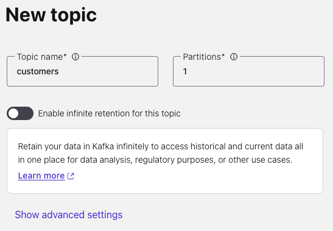
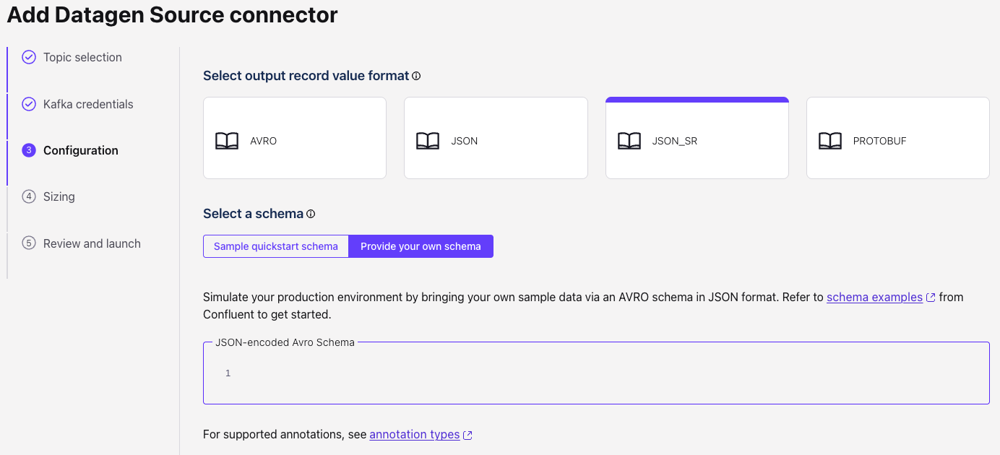
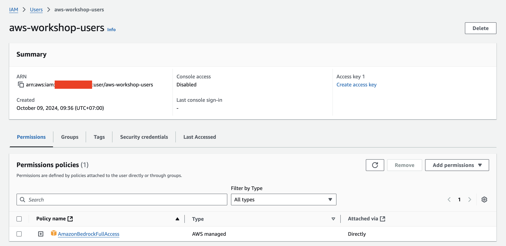
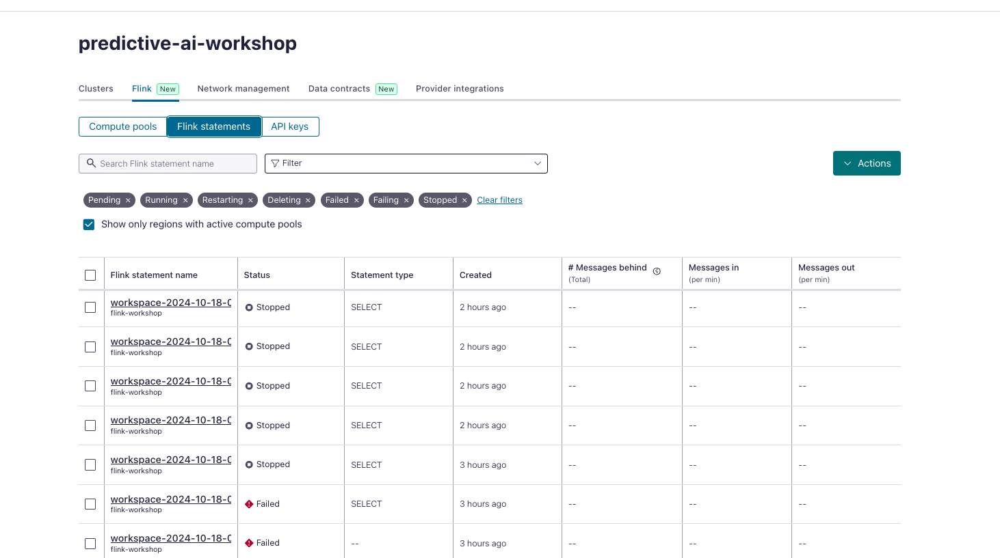
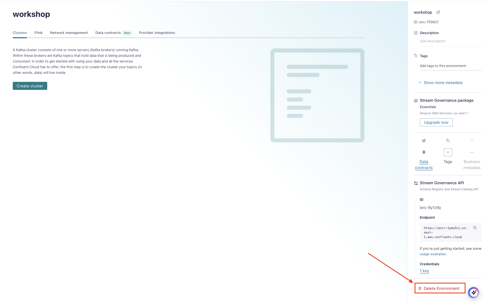

<div align="center" padding=25px>
    
</div>

# <div align="center">Build Predictive Machine Learning Model Using Streaming Data Pipelines</div>
## <div align="center">Lab Guide</div>
<br>

## **Agenda**
1. [Log into Confluent Cloud](#step-1)
2. [Create an Environment and Cluster](#step-2)
3. [Create Flink Compute Pool](#step-3)
4. [Create Topics and walk through Confluent Cloud Dashboard](#step-4)
5. [Create Datagen Connectors for Customers, Credit Cards, and Transactions](#step-5)
6. [Perform Complex Joins using Flink to Combine the Records into One Topic](#step-6)
7. [Aggregate and Filter Transactions using Flink for Potential Fraud](#step-7)
8. [Connect Flink with Bedrock Model](#step-8)
9. [Flink Monitoring](#step-9)
10. [Clean Up Resources](#step-10)
11. [Confluent Resources and Further Testing](#step-11)
***

## **Prerequisites**
<br>

1. Create a Confluent Cloud Account.
    - Sign up for a Confluent Cloud account [here](https://www.confluent.io/confluent-cloud/tryfree/).
    - Once you have signed up and logged in, click on the menu icon at the upper right hand corner, click on “Billing & payment”, then enter promo code ”CONFLUENTDEV1” details under “Payment details & contacts” to delay entering a credit card for 30 days. A screenshot of the billing UI is included below.

> **Note:** You will create resources during this workshop that will incur costs. When you sign up for a Confluent Cloud account, you will get free credits to use in Confluent Cloud. This will cover the cost of resources created during the workshop. More details on the specifics can be found [here](https://www.confluent.io/confluent-cloud/tryfree/).

<div align="center" padding=25px>
    
</div>

2. The latest stable versions of the following web browsers are supported by Confluent Cloud Console:
    - Apple Safari
    - Google Chrome
    - Mozilla Firefox

3. Clone this repo:
   ```
   git clone https://github.com/hendrasutanto/commercial-workshops.git
   ```

4. Install confluent cloud CLI based on your OS (https://docs.confluent.io/confluent-cli/current/install.html)

***

## **Objective**

<br>

Welcome to “Build Predictive Machine Learning Models Using Streaming Data Pipelines”! In this workshop, you will discover how to leverage the capabilities of Confluent Cloud to enable the development of predictive machine learning models using streaming data. We will focus on showcasing how Confluent Cloud, along with Apache Flink and Kafka, can facilitate the creation and deployment of effective data pipelines for real-time analytics.

By the end of this workshop, you'll have a clear understanding of how to utilize Confluent Cloud’s features to build a foundation for machine learning applications, empowering you to transform your streaming data into valuable predictions and insights.

<div align="center" padding=25px>
    
</div>

***


## <a name="step-1"></a>Log into Confluent Cloud

1. Log into [Confluent Cloud](https://confluent.cloud) and enter your email and password.

<div align="center" padding=25px>
    
</div>

2. If you are logging in for the first time, you will see a self-guided wizard that walks you through spinning up a cluster. Please minimize this as you will walk through those steps in this workshop. 

***

## <a name="step-2"></a>Create an Environment and Cluster

An environment contains clusters and its deployed components such as Apache Flink, Connectors, ksqlDB, and Schema Registry. You have the ability to create different environments based on your company's requirements. For example, you can use environments to separate Development/Testing, Pre-Production, and Production clusters. 

1. Click **+ Add Environment**. Specify an **Environment Name** and Click **Create**. 

>**Note:** There is a *default* environment ready in your account upon account creation. You can use this *default* environment for the purpose of this workshop if you do not wish to create an additional environment.

<div align="center" padding=25px>
    
</div>

2. Now that you have an environment, click **Create Cluster**. 

> **Note:** Confluent Cloud clusters are available in 5 types: Basic, Standard, Enterprise, Dedicated, and Freight. Basic is intended for development use cases so you will use that for the workshop. Basic clusters only support single zone availability. The other type of clusters are intended for production use and support Multi-zone deployments. If you are interested in learning more about the different types of clusters and their associated features and limits, refer to this [documentation](https://docs.confluent.io/current/cloud/clusters/cluster-types.html).

3. Chose the **Basic** cluster type. 

<div align="center" padding=25px>
    
</div>

4. Click **Begin Configuration**.
5. For the purpose of this lab, choose ```AWS``` Cloud Provider, region of your choice, and ```single``` availability zone.
6. Specify a **Cluster Name**. For the purpose of this lab, any name will work here.

<div align="center" padding=25px>
    
</div>

7. View the associated *Configuration & Cost*, *Usage Limits*, and *Uptime SLA* information before launching. 
8. Click **Launch Cluster**. 

***

## <a name="step-3"></a>Create a Flink Compute Pool

1. On the Environment level navigation menu, select **Flink** and click **Create Compute Pool**.

<div align="center" padding=25px>
    
</div>

2. Select **Region** and then **Continue**. (You have to use the region where the cluster was created in the previous step)
<div align="center" padding=25px>
    
</div>

3. Name you Pool Name and set the capacity units (CFUs) to ```5```. Click **Finish**.

<div align="center" padding=25px>
    
</div>

> **Note:** The capacity of a compute pool is measured in CFUs. Compute pools expand and shrink automatically based on the resources required by the statements using them. A compute pool without any running statements scale down to zero. The maximum size of a compute pool is configured during creation. 

4. Flink Compute pools will be ready shortly. You can click **Open SQL workspace** when the pool is ready to use.

5. Change your workspace name by clicking **settings button**. Click **Save changes** after you update the workspace name.

<div align="center" padding=25px>
    
</div>

6. Set the Catalog as your environment name.

<div align="center" padding=25px>
    
</div>

7. Set the Database as your cluster name.

<div align="center" padding=25px>
    
</div>

***

## <a name="step-4"></a>Creates Topic and Walk Through Cloud Dashboard

1. On the navigation menu, you will see **Cluster Overview**. 

> **Note:** This section shows Cluster Metrics, such as Throughput and Storage. This page also shows the number of Topics, Partitions, Connectors, and ksqlDB Applications.

2. Click on **Cluster Settings**. This is where you can find your *Cluster ID, Bootstrap Server, Cloud Details, Cluster Type,* and *Capacity Limits*.
3. On the same navigation menu, select **Topics** and click **Create Topic**. 
4. Enter ```customers``` as the topic name, ```1``` as the number of partitions, skip the data contract and then click **Create with defaults**.'

<div align="center" padding=25px>
    
</div>

5. Repeat the previous step and create a second topic name ```credit_cards``` and ```1``` as the number of partitions and skip the data contract.
6. Repeat the previous step and create a second topic name ```transactions``` and ```1``` as the number of partitions and skip the data contract.

> **Note:** Topics have many configurable parameters. A complete list of those configurations for Confluent Cloud can be found [here](https://docs.confluent.io/cloud/current/using/broker-config.html). If you are interested in viewing the default configurations, you can view them in the Topic Summary on the right side. 

7. After topic creation, the **Topics UI** allows you to monitor production and consumption throughput metrics and the configuration parameters for your topics. When you begin sending messages to Confluent Cloud, you will be able to view those messages and message schemas.

***

## <a name="step-5"></a>Create Datagen Connectors for Customers, Credit Cards, and Transactions
The next step is to produce sample data using the Datagen Source connector. You will create three Datagen Source connectors. One connector will send sample customer data to ```customers``` topic, the other connector will send sample credit card data to ```credit_cards``` topic, and the final connector will send sample transaction data to ```transactions``` topic.

1. First, you will create the connector that will send data to ```customers```. From the Confluent Cloud UI, click on the **Connectors** tab on the navigation menu. Click on the **Datagen Source** icon.

<div align="center" padding=25px>
    
</div>

2. Click **Additional Configuration** button.
<div align="center" padding=25px>
    
</div>

3. Choose **customers** topic.
<div align="center" padding=25px>
    
</div>

4. Click **Generate API Key and Download** and give any description. The API key would be downloaded and would be available in the downloads folder in the system
<div align="center" padding=25px>
    
</div>

5. Choose **JSON_SR** for select output record value format.
<div align="center" padding=25px>
    
</div>

6. Click on **Provide Your Own Schema** and paste the following contents
```
{
  "type": "record",
  "name": "CustomerRecord",
  "namespace": "workshop_5",
  "fields": [
    {
      "name": "customer_id",
      "type": {
        "type": "int",
        "arg.properties": {
          "iteration": {
            "start": 100
          }
        }
      }
    },
    {
      "name": "customer_email",
      "type": {
        "type": "string",
        "arg.properties": {
          "options": [
            "alex.jose@gmail.com",
            "james.joe@gmail.com",
            "john.doe@gmail.com",
            "lisa.kudrow@gmail.com",
            "jeniffer.aniston@gmail.com",
            "ross.geller@gmail.com",
            "joey.tribbiani@gmail.com",
            "courtney.cox@gmail.com"
          ]
        }
      }
    },
    {
      "name": "average_spending_amount",
      "type": {
        "type": "int",
        "arg.properties": {
          "range": {
            "min": 1000,
            "max": 1500
          }
        }
      }
    }
  ]
}
```
7. Click on **Continue**, Sizing should be good, click on **Continue** again. You can name the connector anything or leave it as default and click on **Continue**.
<div align="center" padding=25px>
    
</div>

8. After few seconds Connector would be provisioned and running. Check for messages in the ```customers``` topic by navigating to the topics section.
9. Repeat the same steps to create a connector for ```credit_cards``` topic by using the below schema but use existing API key this time.
<div align="center" padding=25px>
    
</div>

```
{
  "type": "record",
  "name": "CreditCards",
  "namespace": "workshop_5",
  "fields": [
    {
      "name": "credit_card_number",
      "type": {
        "type": "long",
        "arg.properties": {
          "iteration": {
            "start": 4699999999999980,
            "step": 1
          }
        }
      }
    },
    {
      "name": "customer_id",
      "type": {
        "type": "int",
        "arg.properties": {
          "iteration": {
            "start": 100
          }
        }
      }
    },
    {
      "name": "maximum_limit",
      "type": {
        "type": "int",
        "arg.properties": {
          "range": {
            "min": 10000,
            "max": 50000
          }
        }
      }
    }
  ]
}
```
<div align="center" padding=25px>
    
</div>

10. Repeat the same steps to create a connector for ```transactions``` topic by using the below schema but use existing API key this time.
<div align="center" padding=25px>
    
</div>

```
{
  "namespace": "workshop_5",
  "name": "transactions",
  "type": "record",
  "fields": [
    {
      "name": "transaction_id",
      "type": {
        "type": "long",
        "arg.properties": {
          "iteration": {
            "start": 1
          }
        }
      }
    },
    {
      "name": "customer_id",
      "type": {
        "type": "int",
        "arg.properties": {
          "range": {
            "min": 100,
            "max": 500
          }
        }
      }
    },
    {
      "name": "amount",
      "type": {
        "type": "int",
        "arg.properties": {
          "range": {
            "min": 1,
            "max": 2000
          }
        }
      }
    },
    {
      "name": "location",
      "type": {
        "type": "string",
        "arg.properties": {
          "options": [
            "Tokyo",
            "Rio",
            "Berlin",
            "Oslo",
            "Stockholm",
            "Nairobi",
            "Spain",
            "Portugal"
          ]
        }
      }
    }
  ]
}
```
<div align="center" padding=25px>
    
</div>

> **Note:** If the connectors fails, there are a few different ways to troubleshoot the error:
> * Click on the *Connector Name*. You will see a play and pause button on this page. Click on the play button.
> * Click on the *Connector Name*, go to *Settings*, and re-enter your API key and secret. Double check there are no extra spaces at the beginning or end of the key and secret that you may have accidentally copied and pasted.
> * If neither of these steps work, try creating another Datagen connector.

11. You can view the sample data flowing into topics in real time. Navigate to  the **Topics** tab and then click on the ```customers```, ```credit_cards```, and ```transactions```. You can view the production and consumption throughput metrics here.

12. Click on **Messages**.

* You should now be able to see the messages within the UI. You can view the specific messages by clicking the icon.
***

## <a name="step-6"></a>Perform Complex Joins using Flink to Combine the Records into One Topic
Kafka topics and schemas are always in sync with our Flink cluster. Any topic created in Kafka is visible directly as a table in Flink, and any table created in Flink is visible as a topic in Kafka. Effectively, Flink provides a SQL interface on top of Confluent Cloud.

1. From the Confluent Cloud UI, click on the **Environments** tab on the navigation menu. Choose your environment.
2. Click on *Flink* from the menu pane
3. Choose the compute pool created in the previous steps.
4. Click on **Open SQL workspace** button on the top right.
5. Create an ```enriched_transactions_regular_join``` table by running the following SQL query.
```sql
CREATE TABLE enriched_transactions_regular_join (
    transaction_id BIGINT NOT NULL PRIMARY KEY NOT ENFORCED,
    credit_card_number BIGINT,
    maximum_limit INT,
    customer_email STRING,
    total_amount INT,
    average_spending_amount INT
)
DISTRIBUTED BY (transaction_id) INTO 1 BUCKETS
WITH (
    'changelog.mode' = 'append'
);
```

6. Add a new query by clicking on + icon in the left of previous query to Insert records to the above table by running the following query.
```sql
INSERT INTO enriched_transactions_regular_join
SELECT 
    transactions.transaction_id,
    credit_cards.credit_card_number,
    credit_cards.maximum_limit,
    customers.customer_email,
    transactions.amount,
    customers.average_spending_amount
FROM transactions
INNER JOIN credit_cards ON transactions.customer_id = credit_cards.customer_id
INNER JOIN customers ON transactions.customer_id = customers.customer_id
```

> **Note:** Regular joins are the most generic type of join in which any new record, or changes to either side of the join, are visible and affect the entirety of the join result.
> For example, if there is a new record on the left side, it will be joined with all the previous and future records on the right side when the product id equals.
> This operation has important operational implications: it requires to keep both sides of the join input in Flink state forever.
> Thus, the required state for computing the query result might grow infinitely depending on the number of distinct input rows of all input tables and intermediate join results.

7. Observe the enriched records in ```enriched_transactions_regular_join``` table by running the following query.
```sql
SELECT * FROM enriched_transactions_regular_join
```

8. The regular join will produce a lot of new records whenever the customer updates their email or credit card information, which is not quite the result that we are looking for. So let's go ahead and **Stop** the above **Insert** and **Select** statement.

9. The ```transactions``` stream needs to join with the ```customers``` and ```credit_cards``` information as of the time of the ```transactions```. To achieve this, we need to use a **temporal join** because the join results depend on the time relationship of the rows.

10. **Temporal Table Join** requires primary key in both ```customers``` and ```credit_cards``` tables. So let's go ahead and re-key both tables with the following queries.
```sql
CREATE TABLE customers_rekeyed (
    customer_id INT NOT NULL PRIMARY KEY NOT ENFORCED,
    customer_email STRING,
    average_spending_amount INT
)
DISTRIBUTED BY (customer_id) INTO 1 BUCKETS
WITH (
    'changelog.mode' = 'upsert'
);
```
```sql
INSERT INTO customers_rekeyed
SELECT
  customer_id,
  customer_email,
  average_spending_amount
FROM customers
```
```sql
CREATE TABLE credit_cards_rekeyed (
    customer_id INT NOT NULL PRIMARY KEY NOT ENFORCED,
    credit_card_number BIGINT,
    maximum_limit INT
)
DISTRIBUTED BY (customer_id) INTO 1 BUCKETS
WITH (
    'changelog.mode' = 'upsert'
);
```
```sql
INSERT INTO credit_cards_rekeyed
SELECT
  customer_id,
  credit_card_number,
  maximum_limit
FROM credit_cards
```

11. Create an ```enriched_transactions_temporal_join``` table by running the following SQL query.
```sql
CREATE TABLE enriched_transactions_temporal_join (
    transaction_id BIGINT NOT NULL PRIMARY KEY NOT ENFORCED,
    credit_card_number BIGINT,
    maximum_limit INT,
    customer_email STRING,
    amount INT,
    average_spending_amount INT
)
DISTRIBUTED BY (transaction_id) INTO 1 BUCKETS
WITH (
    'changelog.mode' = 'append'
);
```

12. Perform the **temporal join** and insert the result of the join into ```enriched_transactions_temporal_join``` by running the following SQL query.
```sql
INSERT INTO enriched_transactions_temporal_join
SELECT 
    transactions.transaction_id,
    credit_cards_rekeyed.credit_card_number,
    credit_cards_rekeyed.maximum_limit,
    customers_rekeyed.customer_email,
    transactions.amount,
    customers_rekeyed.average_spending_amount
FROM transactions
INNER JOIN credit_cards_rekeyed FOR SYSTEM_TIME AS OF transactions.`$rowtime` ON transactions.customer_id = credit_cards_rekeyed.customer_id
INNER JOIN customers_rekeyed FOR SYSTEM_TIME AS OF transactions.`$rowtime`  ON transactions.customer_id = customers_rekeyed.customer_id
```

> **Note:** Watch [this video](https://www.youtube.com/watch?v=ChiAXgTuzaA), David Anderson and Dan Weston talk about how and when to use temporal joins to combine your data.

13. Observe the enriched records in ```enriched_transactions_temporal_join``` table by running the following query.
```sql
SELECT * FROM enriched_transactions_temporal_join
```
<br> 

***

## <a name="step-7"></a>Aggregate and Filter Transactions using Flink for Potential Fraud
In fraud detection, aggregation enhances analysis by providing insights into customer spending habits.
In the next steps, we will use Flink to perform aggregation to find the total spending amount and the number of transactions within 10-minute intervals.
After that, we will define a basic business rules to filter out potential fraudulent transactions based on the aggregated number of transactions.

1. Now we will create a ```potential_fraud``` topic to put all the potential fraudulent transactions into the topic by running the following SQL query.
```sql
CREATE TABLE potential_fraud (
    transaction_id BIGINT PRIMARY KEY NOT ENFORCED,
    credit_card_number BIGINT,
    maximum_limit INT,
    customer_email STRING,
    amount INT,
    average_spending_amount INT,
    total_amount INT,
    transaction_count BIGINT
) 
  DISTRIBUTED BY (`transaction_id`) INTO 1 BUCKETS
  WITH (
  'changelog.mode' = 'append'
)
```

2. When you perform aggregation in SQL, generally the query reduces the number of result rows to one for every group specified in the ```GROUP BY```. In the case, we do not want to reduce the number of result rows into a single row for every group; instead, we want to produce an aggregated value for every input row. In this case, OVER aggregations can be used to serve as the basis for more advanced queries like this.
```sql
INSERT INTO potential_fraud
SELECT 
    transaction_id,
    credit_card_number,
    maximum_limit,
    customer_email,
    amount,
    average_spending_amount,
    SUM(amount) OVER (
        PARTITION BY `credit_card_number`
        ORDER BY `$rowtime`
        RANGE BETWEEN INTERVAL '10' MINUTES PRECEDING AND CURRENT ROW
    ) AS total_amount,
    COUNT(credit_card_number) OVER (
        PARTITION BY `credit_card_number`
        ORDER BY `$rowtime`
        RANGE BETWEEN INTERVAL '10' MINUTES PRECEDING AND CURRENT ROW
    ) AS transaction_count
FROM enriched_transactions_temporal_join
```

***Windows*** are central to processing infinite streams. Windows split the stream into “buckets” of finite size, over which you can apply computations. This document focuses on how windowing is performed in Confluent Cloud for Apache Flink and how you can benefit from windowed functions.

Flink provides several window table-valued functions (TVF) to divide the elements of your table into windows, including:

a. [Tumble Windows](https://docs.confluent.io/cloud/current/flink/reference/queries/window-tvf.html#flink-sql-window-tvfs-tumble)
<br> 
b. [Hop Windows](https://docs.confluent.io/cloud/current/flink/reference/queries/window-tvf.html#flink-sql-window-tvfs-hop)
<br> 
c. [Cumulate Windows](https://docs.confluent.io/cloud/current/flink/reference/queries/window-tvf.html#flink-sql-window-tvfs-cumulate)
<br> 

***

## <a name="step-8"></a>Connect Flink with Bedrock Model
The next step is to create a integrated model from AWS Bedrock with Flink on Confluent Cloud.

1. First, you will create the model connection using Confluent CLI. If you've never installed one, you could install it based on your OS (https://docs.confluent.io/confluent-cli/current/install.html) and login to confluent.
```bash
confluent login
```

2. Make sure you prepare your AWS API Key and Secret to create connection to the Bedrock. (Would be provided in the workshop)

3. Make sure you are using the right environment and right cluster to create the connection. Verify by performing the following.
```bash
confluent environment list
confluent environment use <env-id>
confluent kafka cluster list
confluent kafka cluster use <cluster-id>
```

> **Note:** If you doesn't have any user you could check the step below to create user with full access to Bedrock and creating API key and secret. You could skip this step if you already have user and api key with full access to bedrock.

>Go to **AWS IAM>User** and create User
<div align="center">
    
</div>

>Create User with attach policies for Bedrock Full Access
<div align="center">
    
</div>

<div align="center">
    
</div>

>Create API Key by search your user that has been created and click on the "Create Access Key"
<div align="center">
    
</div>

<div align="center">
    
</div>

<div align="center">
    
</div>

```bash
confluent flink connection create my-connection --cloud aws --region us-east-1 --type bedrock --endpoint https://bedrock-runtime.us-east-1.amazonaws.com/model/meta.llama3-8b-instruct-v1:0/invoke --aws-access-key <API Key> --aws-secret-key <API Secret>
```
3. After creating connection, we need to create the model in Flink before we could invoke on our query.
```sql
CREATE MODEL NotificationEngine
INPUT (details STRING)
OUTPUT (message STRING)
WITH (
  'task' = 'text_generation',
  'provider' = 'bedrock',
  'bedrock.connection' = 'my-connection'
);
```

5. Now let's invoke the model and get the results.

```sql
SELECT message FROM fraudulent_transactions, LATERAL TABLE(ML_PREDICT('NotificationEngine', details));
```
<div align="center" padding=25px>
    
</div>

***

## <a name="step-9"></a>Flink Monitoring
1. Status of all the Flink Jobs is available under **Flink Statements** Tab.
   
<div align="center">
    
</div>

2. Utilization information.
<div align="center">
    
</div>

<br>

***

## <a name="step-10"></a>Clean Up Resources

Deleting the resources you created during this workshop will prevent you from incurring additional charges. 

1. The first item to delete is the Apache Flink Compute Pool. Select the **Delete** button under **Actions** and enter the **Application Name** to confirm the deletion. 
<div align="center">
    
</div>

2. Next, delete the Datagen Source connectors for **credit_cards_connector**, **customers_connector**. Navigate to the **Connectors** tab and select each connector. In the settings tab, you will see a **trash** icon on the bottom of the page. Click the icon and enter the **Connector Name**.
<div align="center">
    
</div>

3. Next, under **Cluster Settings**, select the **Delete Cluster** button at the bottom. Enter the **Cluster Name** and select **Confirm**. 
<div align="center">
    
</div>

4. Finally, to remove all resource pertaining to this workshop, delete the environment **workshop**.
<div align="center">
    
</div>

*** 

## <a name="step-11"></a>Confluent Resources and Further Testing

Here are some links to check out if you are interested in further testing:
- [Confluent Cloud Documentation](https://docs.confluent.io/cloud/current/overview.html)
- [Apache Flink 101](https://developer.confluent.io/courses/apache-flink/intro/)
- [Stream Processing with Confluent Cloud for Apache Flink](https://docs.confluent.io/cloud/current/flink/index.html)
- [Flink SQL Reference](https://docs.confluent.io/cloud/current/flink/reference/overview.html)
- [Flink SQL Functions](https://docs.confluent.io/cloud/current/flink/reference/functions/overview.html)

***
